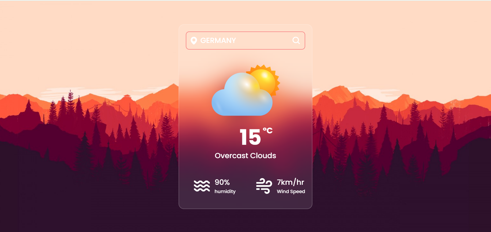

# 🌤️ Weather Application

A simple, responsive weather application that fetches real-time weather data using a public API. Built using **HTML**, **CSS**, and **JavaScript**, this project demonstrates how to consume APIs and display data dynamically in the browser.

## 🚀 Features

- 🔍 Search weather by city name
- 🌡️ Displays current temperature, weather conditions, humidity, and wind speed
- 📱 Responsive design for mobile and desktop
- 🌐 Uses **OpenWeatherMap API**

## 🛠️ Tech Stack

- **HTML5** – semantic structure
- **CSS3** – responsive styling
- **JavaScript** – API fetch and dynamic DOM manipulation
- **API** – [OpenWeatherMap](https://openweathermap.org/api) for weather data

## 📸 Demo Screenshot



## 📦 How to Run Locally

1. Clone this repository:
   ```bash
   git clone https://github.com/AsifAnsari326/weather-app.git
   cd weather-app
